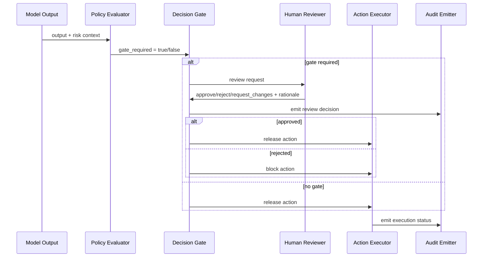

# Authority Separation Architecture

## Purpose

This package defines the architectural pattern that enforces `GAIS-CTRL-AS-01` and `GAIS-CTRL-AS-02`.

## Design Goals

- Separate AI output generation from final action authority.
- Enforce non-bypassable human decision gates for high-risk conditions.
- Produce deterministic audit traces for every review decision.

## Core Components

| Component | Responsibility |
|---|---|
| Policy Evaluator | Evaluates gate triggers from CRI, confidence, drift, and domain policy |
| Decision Gate | Blocks autonomous execution for gated events |
| Reviewer Console | Captures reviewer decision and rationale |
| Action Executor | Executes only after approved gate state |
| Audit Emitter | Writes immutable event trail |

## Control Mapping

- `GAIS-CTRL-AS-01`: Non-bypassable human decision requirement for high-risk outcomes.
- `GAIS-CTRL-AS-02`: Reviewer identity/rationale logging for override decisions.

## Sequence

## Acceptance Criteria

- High-risk events cannot reach executor without explicit human decision.
- Unauthorized actors cannot approve gated events.
- Every gate decision has actor ID, timestamp, outcome, and rationale.
- Blocked/rejected events are recorded and replayable in audit history.
