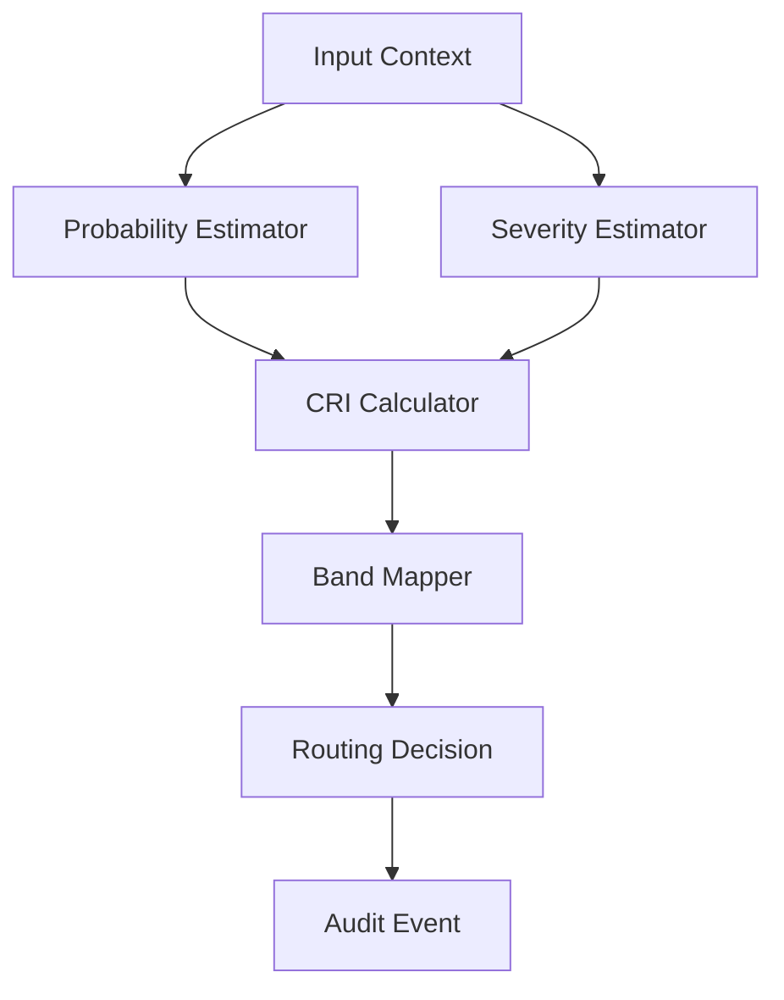

# CRI Risk Engine Pattern

## Runtime Flow

## Interface Contract

Input payload SHOULD contain:

- `probability`: `0..1`
- `severity`: `0..1`
- `policy_version`: string
- `context_tags`: list

Output payload SHOULD contain:

- `cri_score`
- `risk_band`
- `route`
- `policy_version`
- `explanations` (non-sensitive)

## Failure Handling

- Invalid or missing critical inputs MUST fail closed.
- Unknown policy version MUST block autonomous path.
- Calculator errors MUST emit incident candidate event.

## Test Matrix

- Boundary values: `0.24/0.25`, `0.49/0.50`, `0.74/0.75`
- Determinism replay on identical inputs
- Policy version mismatch behavior
- Invalid input handling
