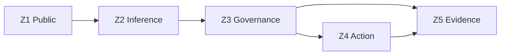

# Trust Boundaries Architecture

## Purpose

This package defines trust zoning and containment controls implementing `GAIS-CTRL-DC-01` and `GAIS-CTRL-DC-02`.

## Trust Zones

| Zone | Typical Assets | Trust Level |
|---|---|---|
| Z1 Public Interface | API ingress, user requests | Untrusted |
| Z2 Inference Plane | Model serving and prompt orchestration | Restricted |
| Z3 Governance Plane | Risk, gate, audit, policy engines | Highly trusted |
| Z4 Action Plane | External tools and side-effecting operations | Highly constrained |
| Z5 Evidence Store | Immutable logs and audit bundles | Highly trusted |

## Boundary Rules

- Calls from Z1 to Z4 MUST NOT occur directly.
- Z4 actions MUST require approved governance token from Z3.
- Z2 cannot mutate governance policies in Z3.
- Evidence writes to Z5 MUST be append-only.

## Data Flow

## Acceptance Criteria

- Network/service policy enforces prohibited edges.
- Every side-effecting action can be traced to Z3 approval.
- Evidence store supports tamper-evident history checks.
